# ServiceLog — Zarządzanie pojazdem zmotoryzowanym

Aplikacja webowa (SPA) do prowadzenia uporządkowanej **historii serwisowej pojazdów**.
Właściciel pojazdu archiwizuje w jednym miejscu wpisy o przeglądach, naprawach i wymianach
części, zleca serwis wybranemu mechanikowi i przegląda oś czasu serwisową swojego pojazdu.
Mechanik przyjmuje zlecenia i uzupełnia raporty z wykonanych prac.

Projekt zrealizowany na przedmiot **Techniki projektowania frontendowego**.

🔗 **Wersja produkcyjna (deploy):** <https://service-log-mu.vercel.app/>

**Autorzy:**

- Mateusz Jankowski (kierownik) — nr albumu D/147551
- Mateusz Kierepka — nr albumu D/161208
- Kamil Jagielski — nr albumu D/147548

---

## Spis treści

1. [Stos technologiczny](#stos-technologiczny)
2. [Uruchomienie projektu](#uruchomienie-projektu)
3. [Zmienne środowiskowe](#zmienne-środowiskowe)
4. [Struktura projektu](#struktura-projektu)
5. [Routing i ekrany](#routing-i-ekrany)
6. [Komponenty współdzielone](#komponenty-współdzielone)
7. [Uwierzytelnianie (Firebase Authentication)](#uwierzytelnianie-firebase-authentication)
8. [Analityka (Hotjar / Contentsquare i Google Analytics)](#analityka-hotjar--contentsquare-i-google-analytics)
9. [Deploy](#deploy)
10. [Stylowanie i system wizualny](#stylowanie-i-system-wizualny)
11. [Zrzuty ekranu aplikacji](#zrzuty-ekranu-aplikacji)
12. [Zakres funkcjonalny i dane](#zakres-funkcjonalny-i-dane)
13. [Status realizacji wg checklisty](#status-realizacji-wg-checklisty)
14. [Powiązana dokumentacja](#powiązana-dokumentacja)

---

## Stos technologiczny

| Obszar               | Technologia                                  |
| -------------------- | -------------------------------------------- |
| Biblioteka UI        | React 19                                     |
| Język                | TypeScript                                   |
| Bundler / dev server | Vite 8                                        |
| Runtime / menedżer   | [Bun](https://bun.sh)                        |
| Routing              | React Router DOM 7                            |
| Biblioteka komponentów | MUI (Material UI) v9 + Emotion             |
| Ikony                | `lucide-react`, `react-icons`                |
| Typografia           | Space Grotesk, Crimson Pro (`@fontsource`)   |
| Uwierzytelnianie     | Firebase Authentication                      |
| Analityka zachowań   | Hotjar / Contentsquare                       |
| Analityka ruchu      | Google Analytics (Firebase, `measurementId`) |
| Hosting / deploy     | Vercel                                       |
| Jakość kodu          | ESLint + Prettier                            |

Architektura komponentów oparta jest o **Atomic Design** (atoms → molecules → organisms →
templates → pages). Każdy komponent ma rozdzielone pliki: logikę (`*.component.tsx`),
typy (`*.types.ts`) oraz style (`*.styles.css`).

---

## Uruchomienie projektu

Wymagany jest zainstalowany [Bun](https://bun.sh).

```bash
# instalacja zależności
bun install

# serwer deweloperski (Vite + HMR)
bun run dev

# build produkcyjny (tsc -b && vite build) -> katalog dist/
bun run build

# podgląd builda produkcyjnego
bun run preview

# lint i formatowanie
bun run lint
bun run lint:fix
```

Po uruchomieniu `bun run dev` aplikacja jest dostępna pod adresem wskazanym w konsoli
(domyślnie `http://localhost:5173`).

---

## Zmienne środowiskowe

Integracje (Firebase, analityka) konfigurowane są przez zmienne środowiskowe Vite z
prefiksem `VITE_`. Należy utworzyć plik `.env` w katalogu głównym (nie jest commitowany)
i uzupełnić go wartościami z konsoli Firebase oraz panelu Hotjar/Contentsquare:

```bash
# Firebase (Project settings → Twoja aplikacja webowa)
VITE_FIREBASE_API_KEY=...
VITE_FIREBASE_AUTH_DOMAIN=...
VITE_FIREBASE_PROJECT_ID=...
VITE_FIREBASE_STORAGE_BUCKET=...
VITE_FIREBASE_MESSAGING_SENDER_ID=...
VITE_FIREBASE_APP_ID=...
VITE_FIREBASE_MEASUREMENT_ID=...        # Google Analytics (właściwość GA4)

# Hotjar / Contentsquare (URL skryptu śledzącego)
VITE_CONTENTSQUARE_SCRIPT_URL=...
```

Konfiguracja Firebase odczytywana jest w `src/firebase.ts`, a skrypt analityki
zachowań w `src/analytics/contentsquare.ts`. Te same zmienne ustawione są w panelu
projektu na Vercel dla buildu produkcyjnego.

---

## Struktura projektu

```
src/
├── App/                      # główny komponent aplikacji + motyw MUI + Routes
│   ├── App.component.tsx
│   ├── App.styles.css
│   └── App.types.ts
├── components/               # komponenty współdzielone (Atomic Design)
│   ├── atoms/
│   │   └── BrandMark/        # logo / znak marki
│   ├── molecules/
│   │   ├── TopNav/           # górny pasek nawigacji
│   │   ├── RoleSwitcher/     # przełącznik roli (właściciel / mechanik)
│   │   ├── VehicleCard/      # karta pojazdu
│   │   └── IncomingOrderCard/# karta zlecenia przychodzącego
│   ├── organisms/
│   │   └── LandingHero/      # sekcja hero strony powitalnej
│   └── templates/
│       └── PageShell/        # layout strony: sidebar (zalogowany) lub TopNav (gość)
├── analytics/
│   └── contentsquare.ts     # ładowanie skryptu Hotjar / Contentsquare
├── firebase.ts              # inicjalizacja Firebase App + Auth
├── pages/                    # widoki podpięte pod routing
│   ├── LandingPage/
│   ├── LoginRegisterPage/
│   ├── MyVehicles/
│   ├── VehicleHistory/
│   ├── AddServiceEntry/
│   ├── CreateServiceOrder/
│   ├── MyOrders/
│   ├── IncomingOrders/
│   ├── WorkReport/
│   ├── UserProfile/
│   ├── MechanicProfile/
│   └── Subpage/              # generyczny placeholder dla tras bez dedykowanego widoku
├── navigation.ts            # definicje pozycji menu i listy tras
└── main.tsx                 # punkt wejścia (BrowserRouter + ThemeProvider + analityka)
```

Każdy ekran z makiety jest osobnym komponentem w katalogu `pages/`, a powtarzalne elementy
interfejsu są wydzielone do `components/`.

---

## Routing i ekrany

Routing realizuje **React Router DOM** (`BrowserRouter` w `main.tsx`, definicje tras w
`App/App.component.tsx`). Nawigacja między ekranami odbywa się bez przeładowania strony.

| Trasa                     | Widok                  | Rola      | Opis                                              |
| ------------------------- | ---------------------- | --------- | ------------------------------------------------- |
| `/`                       | `LandingPage`          | gość      | Strona powitalna z opisem usługi i CTA            |
| `/login-register`         | `LoginRegisterPage`    | gość      | Logowanie / rejestracja przez Firebase (email lub Google) |
| `/my-vehicles`            | `MyVehicles`           | właściciel| Lista pojazdów właściciela                         |
| `/vehicle-history`        | `VehicleHistory`       | właściciel| Oś czasu serwisowa pojazdu z filtrem kategorii     |
| `/add-service-entry`      | `AddServiceEntry`      | właściciel| Formularz dodania wpisu serwisowego                |
| `/create-service-order`   | `CreateServiceOrder`   | właściciel| Kreator zlecenia (pojazd → mechanik → termin)      |
| `/my-orders`              | `MyOrders`             | właściciel| Lista zleceń właściciela (Active / Completed)      |
| `/incoming-orders`        | `IncomingOrders`       | mechanik  | Zlecenia przychodzące (Accept / Decline)           |
| `/work-report`            | `WorkReport`           | mechanik  | Raport z wykonanych prac                           |
| `/user`                   | `UserProfile`          | właściciel| Profil właściciela + przełącznik roli              |
| `/mechanic`               | `MechanicProfile`      | mechanik  | Profil mechanika + przełącznik roli                |

Pozostałe trasy z `navigation.ts` bez dedykowanego widoku renderują generyczny komponent
`Subpage`.

---

## Komponenty współdzielone

Powtarzające się elementy UI zostały wydzielone do reużywalnych komponentów przyjmujących
`props`:

- **`PageShell`** (template) — wspólny szkielet każdej podstrony. Dla widoków zalogowanego
  użytkownika renderuje boczny **sidebar** (ikony z `lucide-react`, akcja `Log Out` przez
  `signOut` z Firebase), a dla gościa górny pasek `TopNav`. Przyjmuje listę pozycji menu
  (`navItems`) i `children`.
- **`TopNav`** (molecule) — górny, poziomy pasek nawigacji renderowany na podstawie
  przekazanej listy pozycji (inny zestaw dla gościa i użytkownika zalogowanego).
- **`RoleSwitcher`** (molecule) — przełącznik widoku właściciel ↔ mechanik na ekranach profilu.
- **`VehicleCard`** (molecule) — karta pojazdu na liście pojazdów.
- **`IncomingOrderCard`** (molecule) — karta zlecenia przychodzącego z akcjami i oznaczeniem
  `URGENT`.
- **`FeatureCard`** (molecule) / **`LandingHero`** (organism) — elementy strony powitalnej.
- **`BrandMark`** (atom) — znak marki / logo.

---

## Uwierzytelnianie (Firebase Authentication)

Logowanie i rejestracja są zrealizowane w oparciu o **Firebase Authentication**:

- inicjalizacja w `src/firebase.ts` (`initializeApp` + `getAuth`),
- **rejestracja** e-mailem: `createUserWithEmailAndPassword` + `updateProfile` (zapis nazwy
  użytkownika),
- **logowanie** e-mailem: `signInWithEmailAndPassword`,
- **logowanie przez Google**: `signInWithPopup` z `GoogleAuthProvider`,
- **wylogowanie**: `signOut` (akcja „Log Out” w sidebarze),
- mapowanie kodów błędów Firebase na czytelne komunikaty dla użytkownika
  (`getAuthErrorMessage` w `LoginRegisterPage`).

Dostawcy `Email/Password` oraz `Google` są włączeni w projekcie Firebase
(`servicelog-762a8`), a autoryzowane domeny (`localhost` oraz domena Vercel) zdefiniowane są
w `firebase.json`.

---

## Analityka (Hotjar / Contentsquare i Google Analytics)

- **Hotjar / Contentsquare** — analityka zachowań użytkowników (m.in. nagrania sesji,
  mapy ciepła). Skrypt śledzący ładowany jest na poziomie głównego punktu wejścia aplikacji
  (`loadContentsquare()` wywoływane w `src/main.tsx`), a jego adres pochodzi ze zmiennej
  `VITE_CONTENTSQUARE_SCRIPT_URL`. Dzięki inicjalizacji w `main.tsx` analityka działa na
  wszystkich trasach SPA.
- **Google Analytics (GA4)** — właściwość GA powiązana z projektem Firebase; identyfikator
  pomiaru przekazywany jest jako `VITE_FIREBASE_MEASUREMENT_ID` w konfiguracji Firebase
  (`src/firebase.ts`).

---

## Deploy

Aplikacja jest wdrożona na **Vercel** (build produkcyjny Vite):

🔗 <https://service-log-mu.vercel.app/>

Zmienne środowiskowe (`VITE_*`) ustawione są w panelu projektu Vercel, a domena produkcyjna
dodana jest do autoryzowanych domen Firebase Authentication.

---

## Stylowanie i system wizualny

Aplikacja korzysta z **ciemnego motywu** zdefiniowanego centralnie w `createTheme` (MUI)
oraz dedykowanych plików `*.styles.css` per komponent. Stylowanie jest spójne i stosowane
konsekwentnie (motyw MUI + CSS), bez „surowego” HTML.

Najważniejsze założenia motywu:

- tryb ciemny, kolor akcentu (primary): `#3b82f6` (niebieski),
- tło: `#0f1117` (default) / `#1a1d27` (paper),
- typografia: nagłówki monospace (Consolas / JetBrains Mono), tekst Space Grotesk,
- zaokrąglenia `borderRadius: 12`, przyciski bez `text-transform`.

Kolorystyka i jednostki odwzorowują makiety Figma (ciemne tło z niebieskim akcentem,
pomarańczowe alerty / etykiety `URGENT`, odznaka `Verified Mechanic`, waluta w USD,
przebieg w milach).

---

## Zrzuty ekranu aplikacji

Poniższe makiety pochodzą z prototypu w Figmie (`img/`). Implementacja odwzorowuje je pod
względem układu ekranów, komponentów i kolorystyki; drobne różnice względem prototypu
zebrano w `protokol-rozbieznosci.pdf`.

### Strona powitalna

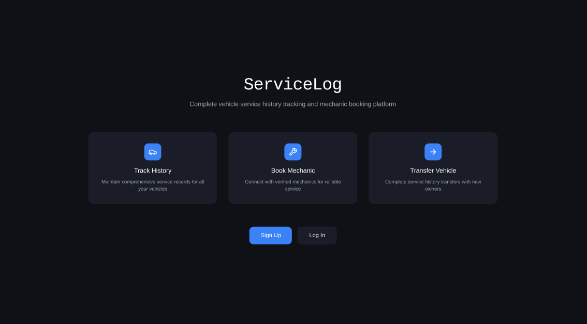

### Logowanie i rejestracja

| Logowanie                | Rejestracja (właściciel)          | Rejestracja (mechanik)             |
| ------------------------ | --------------------------------- | ---------------------------------- |
| 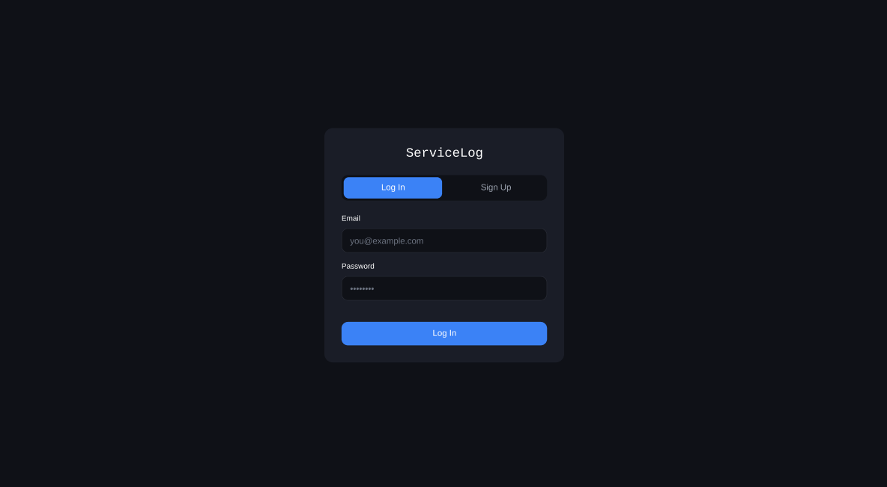 | 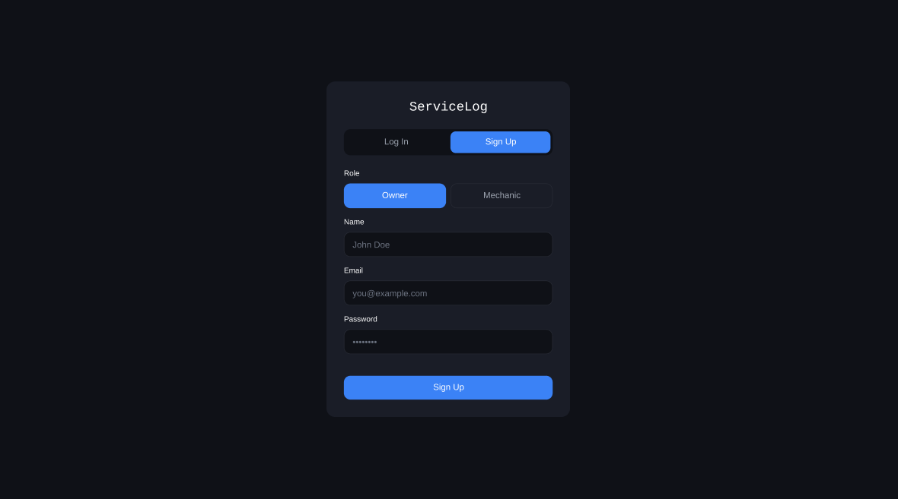 | 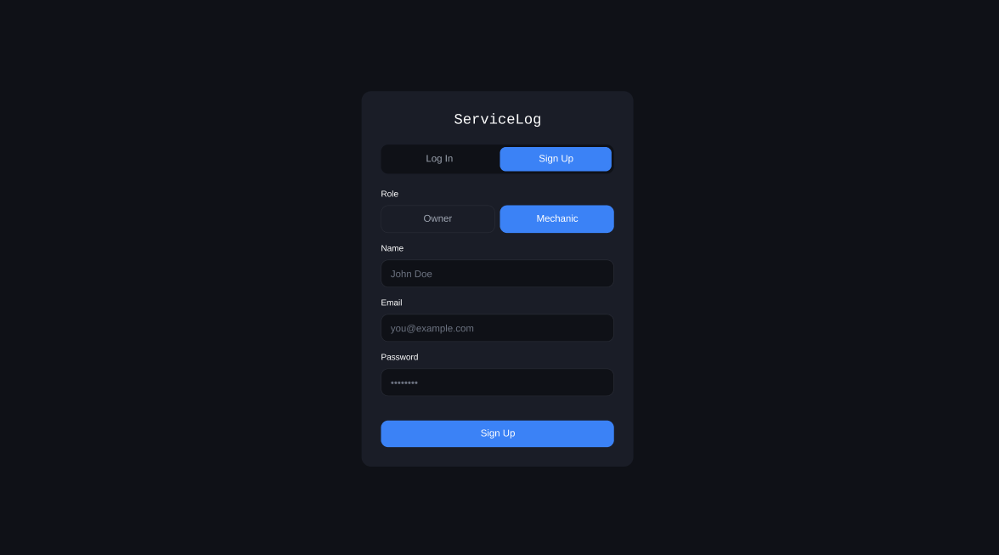 |

### Widok właściciela

**Lista pojazdów**

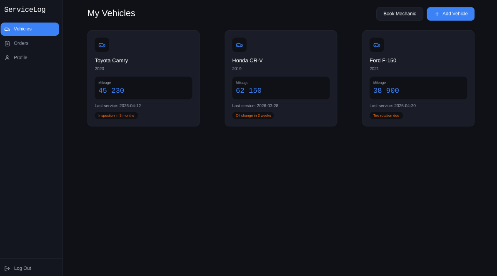

**Oś czasu serwisowa pojazdu**

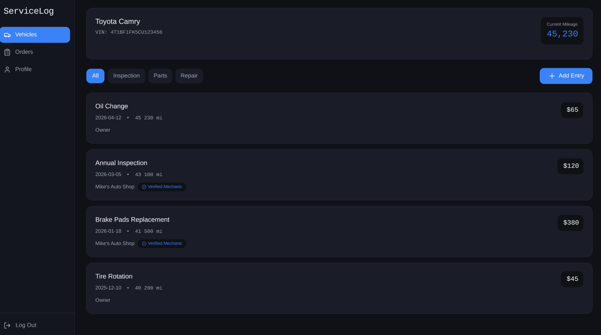

**Dodawanie wpisu serwisowego**

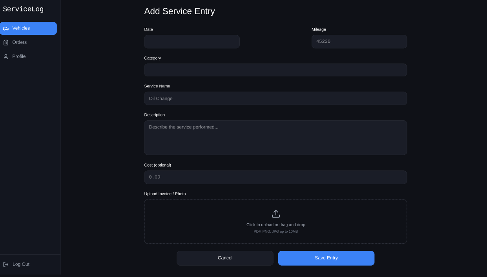

**Kreator zlecenia serwisowego**

| Krok 1 — wybór pojazdu | Krok 2 — wybór mechanika | Krok 3 — termin |
| ---------------------- | ------------------------ | --------------- |
| 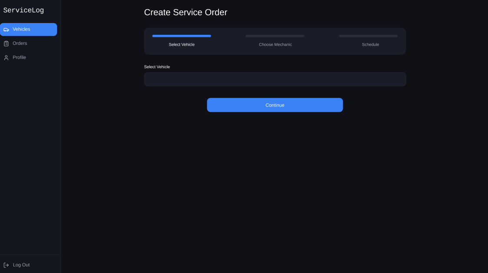 | 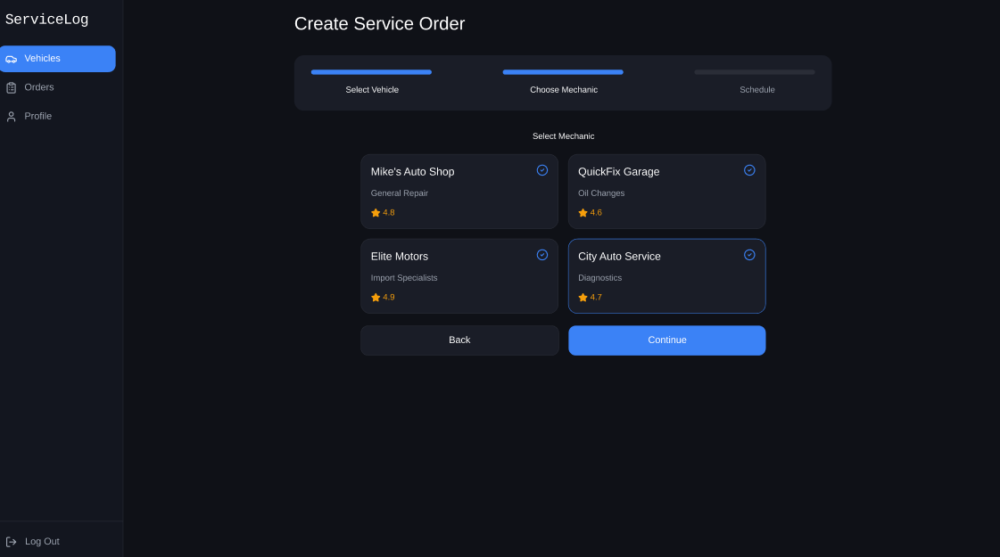 | 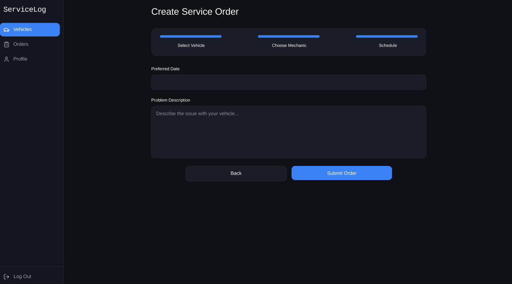 |

**Lista zleceń właściciela**

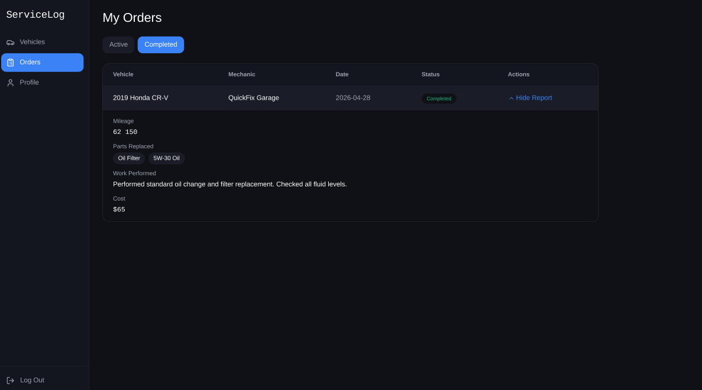

**Profil właściciela**

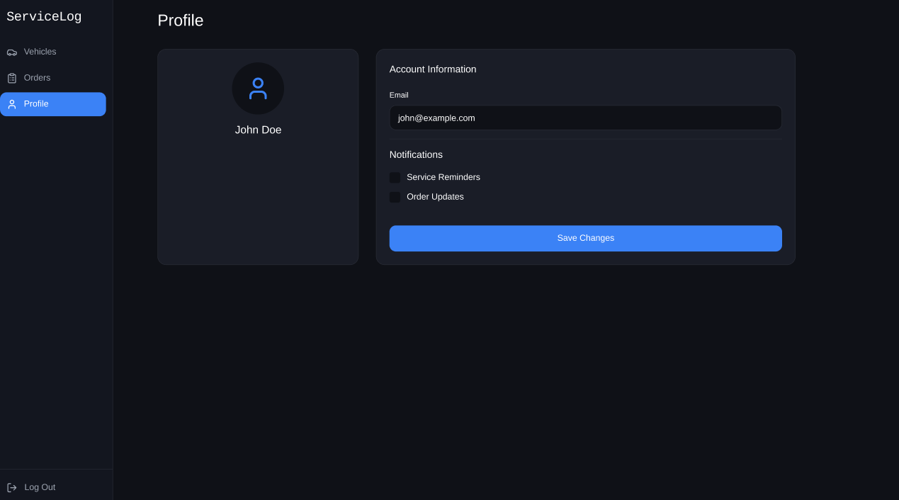

### Widok mechanika

**Zlecenia przychodzące**

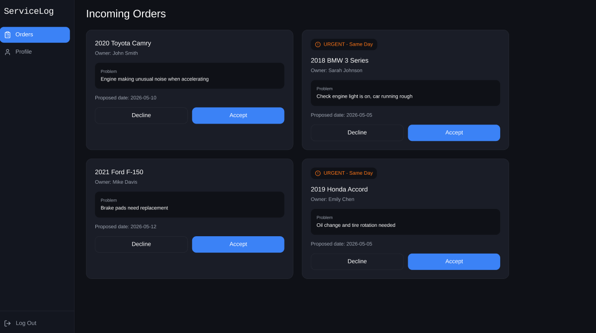

**Raport prac**

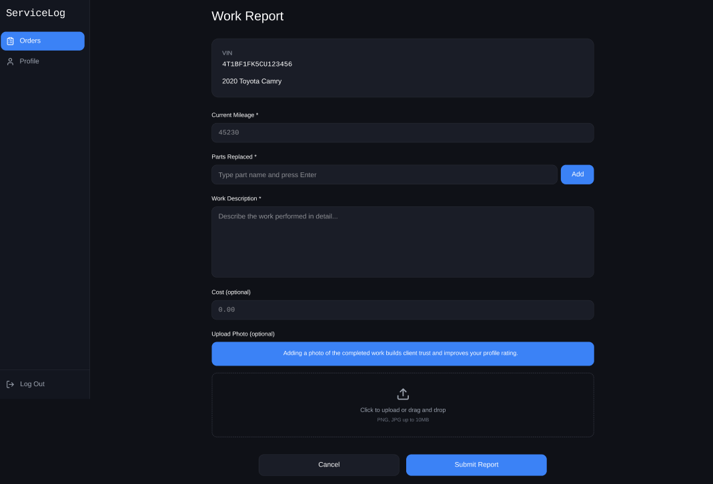

**Profil mechanika**

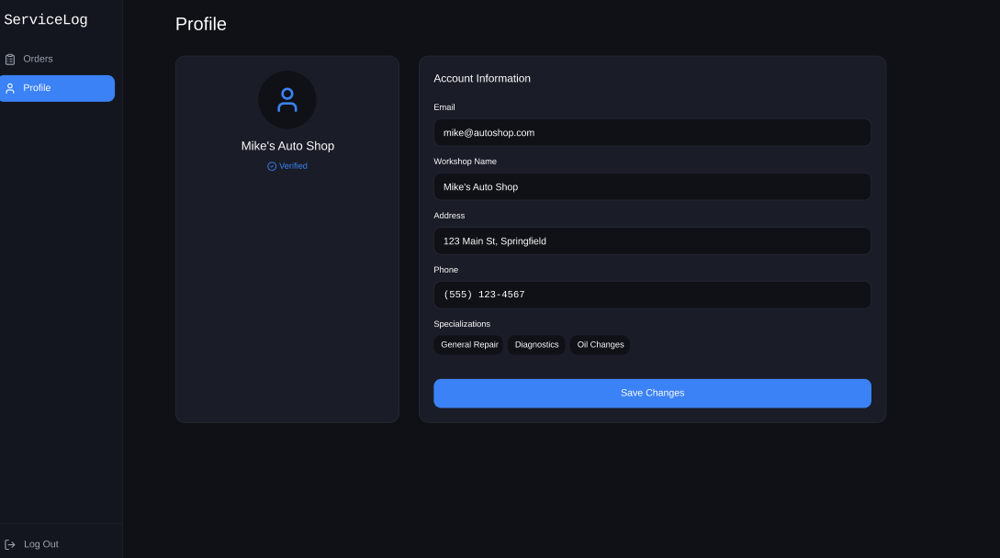

### Analityka — Google Analytics i Hotjar / Contentsquare

> **Do uzupełnienia przez zespół:** checklista wymaga w README zrzutów z panelu Google

<!--  -->
<!--  -->

---

## Zakres funkcjonalny i dane

Projekt koncentruje się na **warstwie prezentacji** (frontend), zgodnie z celem przedmiotu.
Realnie działającą warstwą backendową jest **uwierzytelnianie** (Firebase Authentication —
rejestracja, logowanie e-mailem i przez Google, wylogowanie). Pozostałe dane prezentowane na
ekranach są statycznymi danymi przykładowymi (mocki) zaszytymi w komponentach — nie pochodzą
z backendu. Formularze domenowe (`Submit Order`, `Save Entry`, `Submit Report`,
`Save Changes`) odwzorowują przepływ UI, lecz nie utrwalają danych. Strefy
„Click to upload / drag and drop” są wyłącznie wizualne.

Pełny opis świadomych zawężeń zakresu względem dokumentacji projektowej (m.in. brak panelu
administratora, transferu pojazdu, eksportu PDF, kalendarza wizyt) znajduje się w
`protokol-rozbieznosci.pdf`.

---

## Status realizacji wg checklisty

| Wymaganie checklisty                                         | Status | Uwagi                                                                 |
| ------------------------------------------------------------ | :----: | --------------------------------------------------------------------- |
| Wierne odwzorowanie makiet / prototypu                       |   ✅   | Wszystkie ekrany z Figmy zaimplementowane                              |
| Każdy ekran dostępny przez React Router                      |   ✅   | Trasy w `App.component.tsx`, nawigacja bez przeładowania              |
| Podział widoków na osobne komponenty w `pages/`              |   ✅   | Każdy widok = osobny komponent                                        |
| Powtarzalne elementy wydzielone do `components/`             |   ✅   | Atomic Design, komponenty z `props`                                  |
| Aplikacja ostylowana i czytelna wizualnie                    |   ✅   | Motyw MUI (dark) + CSS per komponent                                  |
| Logowanie użytkownika (Firebase Authentication)              |   ✅   | Email/hasło + Google (`signInWithPopup`), rejestracja, `signOut`      |
| Integracja Hotjar                                            |   ✅   | Hotjar/Contentsquare ładowany w `main.tsx` (`loadContentsquare`)      |
| Integracja Google Analytics                                  |   ✅   | GA4 powiązane z projektem Firebase (`measurementId`)                  |
| Deploy aplikacji                                             |   ✅   | Vercel — <https://service-log-mu.vercel.app/>                         |
| Dokumentacja `README.md` ze screenami aplikacji             |   🟡   | Screeny aplikacji ujęte; **brakuje zrzutów z paneli GA i Hotjar** (do dodania do `img/`) |

Legenda: ✅ zrobione · 🟡 częściowo · ⛔ niezrealizowane.

---

## Powiązana dokumentacja

- `Projekt_TPF_MJankowski_KJagielski_MKierepka.pdf` — pełna dokumentacja projektowa
  (słownik pojęć, badania preferencji użytkownika, diagramy, makiety).
- `protokol-rozbieznosci.pdf` — zestawienie rozbieżności między implementacją a prototypem
  Figma oraz świadomych zawężeń zakresu.
- `PROJEKT - CHECKLISTA.pdf` — checklista wymagań przedmiotu.
